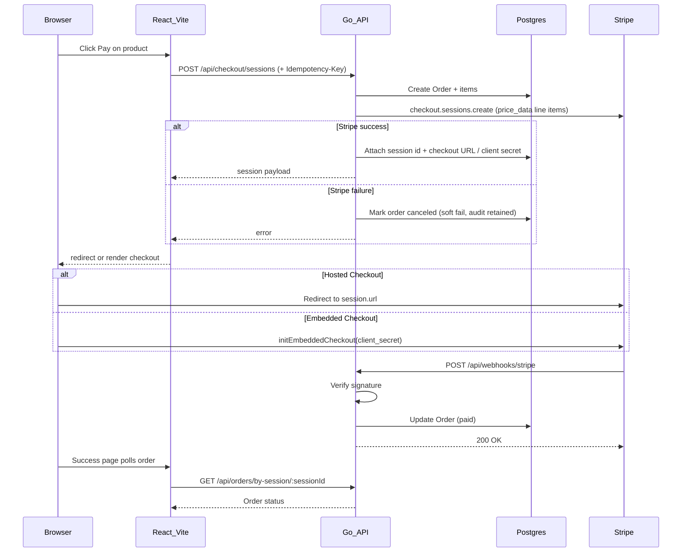
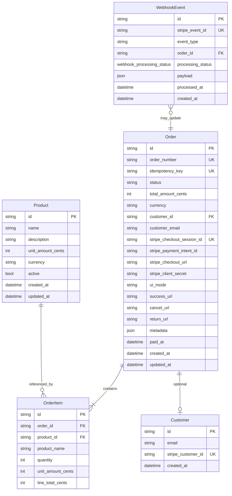

# Stripe Payment Integration — Design

## Context

Greenfield prototype: **receive one-time payments** via Stripe with a **Go backend** and **React frontend**.

**Scope (v1)**
- Hosted Checkout (redirect) **and** Embedded Checkout (`ui_mode: embedded`)
- Async payment webhooks, full order state machine, REST API, React SPA

**Stripe integration principles** (API version **2026-05-27.dahlia**):
- **Checkout Sessions API** as the single payment backend for both UI modes
- Omit `payment_method_types` — enable dynamic payment methods from Dashboard
- Verify webhook signatures; use restricted API keys (`rk_`) in production
- Never use Charges API or legacy Card Element

---

## Architecture

### Tech stack

| Layer | Choice | Rationale |
|-------|--------|-----------|
| Backend | **Go** (`chi` router) | Typed HTTP API; idiomatic Stripe webhook handling |
| Frontend | **Vite + React + TypeScript** | Lightweight SPA; required for Stripe Embedded Checkout |
| DB access | **sqlc + pgx** | Type-safe SQL from schema |
| Migrations | **golang-migrate** | Versioned SQL migrations |
| DB | **PostgreSQL 16 (Docker)** | Production-like local dev |
| Stripe SDK | `stripe-go` (server), `@stripe/stripe-js` + `@stripe/react-stripe-js` (client) | Official SDKs; Go pins API version to SDK release |

---

## Data model

### Entity relationship

### Order status

| Status | Meaning |
|--------|---------|
| `pending` | Order exists; awaiting Stripe session attachment and/or customer payment |
| `processing` | `checkout.session.completed` received but payment is async (e.g. bank debit); awaiting `async_payment_succeeded` |
| `paid` | Payment confirmed |
| `expired` | `checkout.session.expired` |
| `failed` | `async_payment_failed` or unrecoverable payment failure |
| `canceled` | Checkout session creation failed; order retained for audit |
| `refunded` | `charge.refunded` webhook; only from `paid` |

**State machine rules** (supports out-of-order webhooks):
- Transitions are **monotonic forward** — never downgrade `paid` or `refunded`
- `pending` may jump directly to `paid` if `async_payment_succeeded` arrives before `checkout.session.completed`
- `pending` → `processing` → `paid` is the typical async path, but `pending` → `paid` is valid
- `expired` / `canceled` only apply if not already `paid` or `processing`

**Other enums**: `UiMode` (`hosted` | `embedded`); `WebhookProcessingStatus` (`received` | `processing` | `processed` | `ignored` | `failed`)

### Design decisions

**Catalog & line items**
- Catalog lives in Postgres; Stripe line items use dynamic `price_data` (not Stripe Price IDs) in v1
- **Snapshot line items** on `OrderItem` so historical orders stay accurate if catalog prices change
- **Single currency per order** — reject mixed-currency line items before creating a session
- **`price_data` tradeoff** — creates ephemeral Stripe Products per checkout; fine for prototype. **v2**: sync catalog to Stripe Products/Prices

**Order identity & correlation**
- **`orderNumber`** human-readable (e.g. `ORD-20250610-XXXX`) for support/receipts; internal `id` is opaque and sortable
- **`stripeCheckoutSessionId`** is the primary Stripe correlation key; all webhook handlers resolve orders via session ID
- **`WebhookEvent.stripeEventId`** deduplicates deliveries — `processed` events are no-ops; `failed` events are retried on Stripe redelivery

**Customer handling (v1)**
- No auth in v1. Guest email stored on `orders.customer_email` and passed to Stripe for checkout pre-fill
- **Do not** upsert `customers` by email — prevents account pollution. Link `customer_id` only when JWT auth exists (v2)

**Checkout lifecycle**
- **Soft-fail, never hard-delete orders** — DB insert commits **before** the Stripe HTTP call. On Stripe API error or persist failure: set `status = canceled`, write `metadata.cancel_reason`, retain row for audit. Best-effort `session.Expire` on failure paths
- **Stale in-flight orders** — `pending` orders with no `stripe_checkout_session_id` older than 15 minutes may be marked `canceled` with `cancel_reason = stale_checkout`
- **Redirect URLs are server-built** from `APP_FRONTEND_URL` — never accepted from the client (prevents open redirects)

**Idempotency**
- Optional `Idempotency-Key` header on checkout creation. Duplicate key + identical body → return cached session. Duplicate key + different body → `409 IDEMPOTENCY_CONFLICT`
- **In-flight guard**: if a row exists for the key but session ID is still null → `409 CHECKOUT_IN_PROGRESS`; client retries after backoff
- Same key pointing to a `canceled` order → create a **new** order (old row kept for audit)
- **`stripe_client_secret`** stored in DB for idempotency replay only; never returned from order lookup endpoints

**Stripe constraints**
- User-supplied `metadata` validated: max 50 keys, string values only, max 500 chars each

---

## API contract

All JSON responses use an envelope: `{ "data": { ... }, "error": null }`. Errors: `{ "data": null, "error": { "code", "message", "details" } }`.

### Health

| Endpoint | Purpose |
|----------|---------|
| `GET /health/live` | Process liveness — always `200` if server is running |
| `GET /health/ready` | Readiness — `200` when DB connected; `503` when DB down |
| `GET /health` | Alias for `/health/ready` |

### `GET /api/products`

List active catalog products. Amounts and currency returned for display; prices are never trusted from the client on checkout.

### `POST /api/checkout/sessions`

Create an order and Stripe Checkout Session.

**Request**
| Field | Required | Notes |
|-------|----------|-------|
| `uiMode` | yes | `"hosted"` or `"embedded"` |
| `items` | yes | Min 1 item; `productId` must exist and be active; amounts computed server-side |
| `customerEmail` | no | Pre-fills Stripe Checkout; stored on order only (no Customer upsert) |
| `metadata` | no | Stored on Order + passed to Stripe metadata |

**Headers**: optional `Idempotency-Key` (UUID). Frontend should generate once per checkout attempt and persist across page refresh to prevent duplicate orders on double-click.

**Redirect URLs** (server-built from `APP_FRONTEND_URL`, never from client):

| `uiMode` | URL |
|----------|-----|
| `hosted` | `success_url`: `{APP_FRONTEND_URL}/checkout/success?session_id={CHECKOUT_SESSION_ID}` |
| `hosted` | `cancel_url`: `{APP_FRONTEND_URL}/checkout/cancel` |
| `embedded` | `return_url`: `{APP_FRONTEND_URL}/checkout/complete` |

**Response 201 — hosted**: `orderId`, `orderNumber`, `sessionId`, `url`, `accessToken`

**Response 201 — embedded**: `orderId`, `orderNumber`, `sessionId`, `clientSecret`, `accessToken`

`accessToken` is a one-time scoped secret for order reads; store client-side (e.g. `sessionStorage` keyed by `sessionId`).

**Error codes**: `VALIDATION_ERROR` (400), `PRODUCT_NOT_FOUND` (404), `IDEMPOTENCY_CONFLICT` (409), `CHECKOUT_IN_PROGRESS` (409), `STRIPE_ERROR` (502)

### `GET /api/orders/:id` and `GET /api/orders/by-session/:sessionId`

Poll order status after redirect. Returns `orderNumber`, `status`, `totalAmountCents`, `currency`, `paidAt`, line items. No PII beyond what is needed for the receipt view.

**Polling**: treat `pending` and `processing` as in-flight; poll until terminal status or timeout (~30s). Final payment truth comes from webhooks, not the redirect alone.

**Access control**: order reads require `X-Order-Token` header matching the hash stored at checkout creation. Missing or invalid token → `401`.

### `POST /api/auth/session`

Issue a guest JWT for email-scoped order history (v1.5 auth).

**Request**: `{ "email": "buyer@example.com" }`

**Response 200**: `{ "token", "expiresAt", "role": "guest" }` — 7-day HS256 JWT.

### `GET /api/orders/mine`

List recent orders for the authenticated guest email. Requires `Authorization: Bearer <token>`.

### `POST /api/webhooks/stripe`

Stripe webhook endpoint. **Raw body required** for signature verification.

**Handled events**

| Event | Action |
|-------|--------|
| `checkout.session.completed` | If `payment_status=paid` → `paid` (skip `processing`). If `unpaid` → `processing`. Store `payment_intent`, set `paidAt` when `paid` |
| `checkout.session.async_payment_succeeded` | If `pending` or `processing` → `paid`. Store `payment_intent`, set `paidAt` |
| `checkout.session.async_payment_failed` | Set `failed` (only if not `paid`) |
| `checkout.session.expired` | Set `expired` (only if not `paid` or `processing`) |
| `charge.refunded` | Resolve order via `stripe_payment_intent_id` → `refunded` (only from `paid`; idempotent if already `refunded`) |

Session handlers resolve the order via `session.id` → `orders.stripe_checkout_session_id`. Refund handler resolves via `payment_intent` on the charge object. Store `stripe_payment_intent_id` on every path that reaches `paid`. Do **not** use standalone `payment_intent.payment_failed`.

**Processing model**
1. Verify `Stripe-Signature` against raw body (`IgnoreAPIVersionMismatch` off in production; pin `STRIPE_API_VERSION`)
2. Upsert `WebhookEvent` by `stripeEventId` — `processed` / `ignored` → no-op `200`; `failed` → retry on redelivery
3. Claim `received` / `failed` → `processing`; reclaim stale `processing` (>5 min) on retry
4. Atomically update order status + mark webhook `processed` in one DB transaction
5. Handler error → `500` (Stripe retries); invalid signature → `400`; concurrent in-flight → `503`
6. Unhandled event types → record as `ignored`, return `200`

---

## Frontend flows

React SPA. All API calls go to the Go backend. Checkout requests send an `Idempotency-Key` stored in `sessionStorage` per product — survives refresh, prevents duplicate orders. Clear the key before redirecting to hosted checkout so repeat purchases start fresh. On `409 CHECKOUT_IN_PROGRESS`, retry after ~500ms.

**User journey**
1. Catalog lists products from `GET /api/products`
2. Each product offers **Pay (Hosted)** and **Pay (Embedded)**
3. Hosted: create session → redirect to `session.url`
4. Embedded: create session → render `EmbeddedCheckoutProvider` with `clientSecret`
5. Success/complete pages poll order status via session ID

| Route | Purpose |
|-------|---------|
| `/` | Product catalog |
| `/checkout/hosted` | Create hosted session → redirect |
| `/checkout/embedded` | Create embedded session → render checkout |
| `/checkout/success` | Hosted success; poll order |
| `/checkout/cancel` | Hosted cancel confirmation |
| `/checkout/complete` | Embedded return URL; poll order |

---

## Security

- Webhook signature verification on every event; raw body before JSON decode
- Idempotent webhook processing via `WebhookEvent.stripeEventId`
- Idempotent checkout via `Idempotency-Key` + in-flight guard (`409 CHECKOUT_IN_PROGRESS`)
- `stripe_client_secret` never returned from order lookup endpoints
- Server-side price validation — never trust client-submitted amounts
- Redirect URLs server-built from `APP_FRONTEND_URL` — no open redirects
- Restricted API key in production; no secret keys in client bundle or logs
- CORS restricted to known origin
- Webhook failures return `500` to trigger Stripe retry; concurrent in-progress returns `503`
- Orders never hard-deleted; failures set `canceled` with `cancel_reason`
- No `Customer` upsert by email without authentication
- Structured logging with request ID; never log secrets or full card data
- Order access tokens (`X-Order-Token`) on all order read endpoints
- Guest JWT for `GET /api/orders/mine` (`AUTH_JWT_SECRET`)
- Rate limiting: checkout 20/min, order reads 120/min per IP; `429` with `Retry-After`
- Request body limit 1 MiB; `413` on overflow
- Security headers on API; CSP on nginx frontend (Stripe.js allowlist)
- `ENV=production` rejects localhost origins, test Stripe keys, `sslmode=disable`
- Prometheus `/metrics` gated by `METRICS_API_KEY`

---

## Testing focus

| Layer | What to verify |
|-------|----------------|
| **Service** | Price validation, guest email (no Customer upsert), idempotency replay, in-flight guard, soft-cancel on failure, stale checkout cleanup, out-of-order `pending` → `paid` |
| **Webhook handler** | Optimistic lock concurrency, out-of-order async events, `payment_intent` on all paid paths |
| **Checkout handler** | Stripe error → `canceled` (not delete), idempotency on canceled orders creates new row |
| **Integration** | Stripe CLI webhook triggers against local endpoint |
| **E2E** | `TestE2EWebhookCheckoutCompleted` — signed fixture through router against real Postgres (CI) |

---

## Out of scope (v1)

- Subscriptions / recurring billing
- Refunds UI (webhook handler exists; no admin/refund API or UI)
- Stripe Connect / marketplace splits
- Tax (Stripe Tax)
- Multi-currency adaptive pricing
- Full user accounts (passwords, OAuth, admin roles)
- Customer table linkage (requires authenticated user ID)

## Future (v2)

- Stripe catalog sync — persist Stripe Product/Price IDs; switch line items from `price_data` to Price ID
- Full JWT auth + `Customer` linkage via authenticated user ID (beyond guest email sessions)
- Partial refunds, disputes (`charge.dispute.*`), reconciliation reporting
- OpenTelemetry tracing, error tracking (Sentry/Datadog), alert runbooks
- External Secrets Operator / Vault integration (K8s templates exist; not wired)
- Browser E2E (Playwright), load/chaos testing

---

## Production readiness critique

**Overall score: ~75%** for a payment microservice, **~55%** as a full product platform.

This is no longer a toy prototype. For **accepting one-time Stripe payments behind your own app** it is deployable with ops discipline. For **a customer-facing SaaS with accounts, compliance, and 24/7 ops** meaningful gaps remain.

### Tier breakdown

| Dimension | Grade | Notes |
|-----------|-------|-------|
| **Payment correctness** | A | Server-side pricing, idempotency (app + Stripe), webhook verify + dedup, atomic completion, stale reclaim, refunds via `charge.refunded` |
| **Security (payment path)** | B+ | Order access tokens, guest JWT, rate limits, body limits, CORS, CSP on nginx, prod config guards |
| **Reliability** | B | Health live/ready, graceful shutdown, stale order cleanup, webhook crash recovery; no multi-region / HA story |
| **Observability** | C+ | JSON logs, request IDs, Prometheus `/metrics`; no tracing, no alerting runbooks, no SLOs |
| **Operations / deploy** | B− | Dockerfiles, compose prod, K8s Job + deployment templates, `migrate-release`; not wired to a real cluster/CD |
| **Auth & identity** | C+ | Guest email JWT + order tokens; no passwords, OAuth, admin roles, or `customers` linkage |
| **Testing** | B | Strong unit + DB integration; one E2E webhook in CI; no browser E2E, no load/soak tests |
| **Compliance & scale** | D | No PCI scope doc, audit log, data retention, GDPR flows, or horizontal scaling design |

### What is genuinely production-grade

**Payment path** — the bar that matters most for go-live:

- Checkout never trusts client prices
- Webhooks are verified, idempotent, and recover from crashes (`processing` reclaim)
- Order updates and webhook marks are transactional
- Refunds transition `paid` → `refunded` by payment intent
- Stripe API version pinned and enforced in production webhooks
- Compensation on Stripe/DB failures (cancel + expire session)

**Security baseline** for an internal or low-traffic service:

- Order reads require `X-Order-Token` (not guessable IDs alone)
- Rate limiting with proper `429` + `Retry-After`
- `ENV=production` rejects localhost, test keys, `sslmode=disable`
- Metrics endpoint gated by API key

**Ops foundations**:

- `/health/live` vs `/health/ready`
- Migrate-as-release-job pattern (`deploy/kubernetes/migrate-job.yaml`, `scripts/migrate-release.sh`)
- `docker-compose.prod.yml` for full local stack

### What keeps it from full production platform

1. **Identity is guest-only** — JWT sessions are email-scoped, not accounts. No password reset, OAuth, role-based admin, or per-user audit.
2. **Observability stops at metrics** — Prometheus scrape works; no distributed tracing, error tracking, dashboards, or alert rules in repo.
3. **Secrets are templates, not integrated** — K8s `secrets.example.yaml` exists; External Secrets Operator / Vault not wired. Compose uses flat env vars.
4. **No edge WAF / DDoS layer** — App-layer rate limits help; no Cloudflare/AWS WAF or bot protection.
5. **Testing gaps** — One E2E webhook test; no Playwright checkout flow, chaos testing, or load tests.
6. **Documentation drift** — README still minimal vs implemented features (migrations, auth, metrics, prod compose).
7. **Partial refund / dispute edge cases** — Full `charge.refunded` handled; partial refunds, disputes, reconciliation not.
8. **Horizontal scale not proven** — Stateless API + Postgres is fine at moderate scale; no read replicas or multi-replica webhook concurrency analysis.

### Use-case verdict

| Scenario | Ready? |
|----------|--------|
| Internal tool / demo / MVP (<1k orders/mo) | Yes — with `make migrate`, prod env, Stripe live keys |
| B2B embed “pay for X” behind your auth | Yes — treat as payment service; your app owns users |
| Public consumer storefront at scale | Risky without tracing, alerting, full auth, load tests |
| Regulated / enterprise | No — needs compliance package, audit trails, key rotation, pen test |

### Minimum before production deploy

1. Run migrations through `000003_production_hardening` on prod DB
2. Set `ENV=production`, HTTPS URLs, live Stripe keys, strong `AUTH_JWT_SECRET`, `METRICS_API_KEY`
3. Wire secrets via platform (K8s Secret / ESO), not `.env` on disk
4. Add alerting on: `/health/ready` failures, webhook `processing_failed` rate, checkout 5xx
5. Document rollback + Stripe Dashboard webhook replay procedure
6. Complete [Stripe go-live checklist](https://docs.stripe.com/get-started/checklist/go-live)

### Bottom line

The **money path is production-grade** for a focused checkout service. The **platform around it** (identity, observability depth, ops maturity, compliance) is **strong prototype / early production** — roughly three-quarters of the way for a payment microservice, halfway if you need a standalone customer-facing product.
