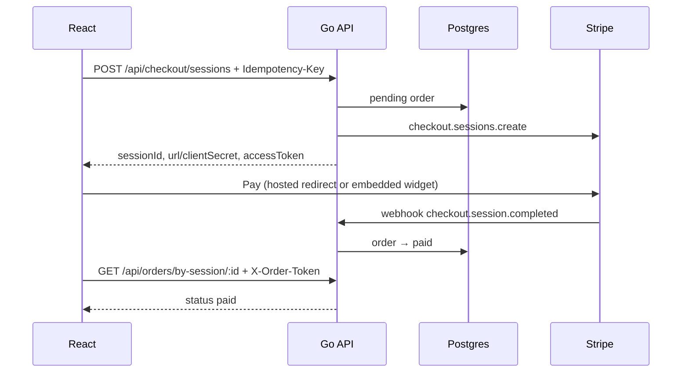

# Stripe Payment Integration — Design

One-time card payments via **Stripe Checkout**. Stack: **Go API** (`:8080`) · **React** (`:5173`) · **Postgres** · **Stripe** (`2026-05-27.dahlia`, Checkout Sessions only).

**Golden rule:** Prices come from **Postgres**, not the browser. Client sends only `productId` + `quantity`.

| Checkout mode | UX | Frontend uses |
|---------------|-----|---------------|
| Hosted | Redirect to Stripe | `session.url` |
| Embedded | Pay on your page | `session.clientSecret` |

---

## How a payment works

Two paths run in parallel:

| Path | Driver | Role |
|------|--------|------|
| **User** | Browser | Checkout UX; polls order status on success page |
| **Webhook** | Stripe → API | **Source of truth** — flips order to `paid` |

1. API inserts `pending` order, creates Stripe session, returns `accessToken`.
2. User pays on Stripe.
3. Webhook verifies signature, dedupes by `stripe_event_id`, updates order atomically.
4. Frontend polls every ~1s (≤30s) for UX — **webhook decides payment truth**.

---

## Backend layout

`handler/` → `service/` → `db/` (wired in `internal/server/router.go`, boot in `cmd/server/main.go`).

Also: `stripeclient/` (SDK), `middleware/` (rate limit, JWT, logging), `auth/` (order tokens + guest JWT).

---

## Data model

| Table | Purpose |
|-------|---------|
| `products` | Catalog — price source of truth |
| `orders` | Purchase attempt + Stripe session id + status |
| `order_items` | Line items snapshotted at checkout |
| `webhook_events` | Dedup log — each `stripe_event_id` once |

`customers` exists but unused in v1.

**Order status:** `pending` → `processing` → `paid` | `expired` | `failed` | `canceled` | `refunded`. Forward-only; no downgrade from `paid`/`refunded`. Webhooks may arrive out of order.

**Webhook processing:** `received` → `processing` → `processed` | `ignored` | `failed` (stale `processing` reclaimed after 5 min).

**Key rules:**
- Pricing via Stripe `price_data` from DB; one currency per order.
- Order inserted before Stripe call; failures → `canceled` (never deleted).
- Redirect URLs from `APP_FRONTEND_URL` only (no client-supplied URLs).
- `Idempotency-Key`: same key+body replays session; mismatch → `409`; in-flight → `409 CHECKOUT_IN_PROGRESS`.
- `accessToken` → `X-Order-Token` for order reads; guest JWT for `/api/orders/mine`.

---

## API

Envelope: `{ "data": …, "error": null }` or `{ "data": null, "error": { "code", "message" } }`.

| Endpoint | Notes |
|----------|-------|
| `GET /health/live`, `/health/ready` | Liveness / readiness |
| `GET /api/products` | Catalog |
| `POST /api/checkout/sessions` | `uiMode`, `items[]`; header `Idempotency-Key` |
| `GET /api/orders/by-session/:id` | Poll after pay; `X-Order-Token` |
| `GET /api/orders/:id` | Same token |
| `POST /api/auth/session` | Guest JWT by email |
| `GET /api/orders/mine` | Bearer JWT |
| `POST /api/webhooks/stripe` | Stripe events |
| `GET /metrics` | Prometheus; `X-API-Key` |

**Checkout 201:** `orderId`, `orderNumber`, `sessionId`, `accessToken`, `url` or `clientSecret`.

**Webhook → order:**

| Event | Status |
|-------|--------|
| `checkout.session.completed` | `paid` or `processing` |
| `checkout.session.async_payment_succeeded` | `paid` |
| `checkout.session.async_payment_failed` | `failed` |
| `checkout.session.expired` | `expired` |
| `charge.refunded` | `refunded` |

Invalid signature → `400`. Handler failure → `500` (Stripe retries). Concurrent claim → `503`.

---

## Frontend

Vite + React; dev proxy `/api` → `:8080`.

| Route | Action |
|-------|--------|
| `/` | Catalog |
| `/checkout/hosted?productId=` | Redirect to Stripe |
| `/checkout/embedded?productId=` | Embedded widget |
| `/checkout/success?session_id=` | Poll (hosted) |
| `/checkout/complete` | Poll (embedded) |
| `/checkout/cancel` | Cancel page |

`Idempotency-Key` in `sessionStorage` per product; clear before hosted redirect.

---

## Security & ops

Webhook signature on raw body · server-side pricing · order tokens · rate limits · CORS to `CORS_ORIGIN` · no `client_secret` on order reads · structured logs (no secrets/card data).

**Prod:** `ENV=production`, live keys, `AUTH_JWT_SECRET`, `METRICS_API_KEY`, TLS on DB, secrets in K8s/vault.

**Stack:** Go + chi + pgx · Postgres 16 · `golang-migrate` · `stripe-go` + `@stripe/react-stripe-js`.

**Tests:** service (pricing, idempotency), webhook (out-of-order, refunds), DB integration, E2E webhook in CI.

---

## Scope

**v1 out:** subscriptions, Connect, Tax, refund UI, full accounts.

**v2:** Stripe Price sync, real auth, disputes/reconciliation, OpenTelemetry, Playwright E2E.

---

## Production readiness

**~75%** payment microservice · **~55%** full platform. Money path is solid behind your own auth; platform layer (identity, tracing, compliance) has gaps.

| Area | Grade | Gap |
|------|-------|-----|
| Payments | A | — |
| Security | B+ | Guest JWT only |
| Reliability | B | No HA design |
| Observability | C+ | No tracing/alerts in repo |
| Ops | B− | K8s templates, no real CD |
| Compliance | D | No PCI/GDPR docs |

| Scenario | OK? |
|----------|-----|
| MVP / internal tool | Yes |
| Behind your app's auth | Yes |
| Public at scale | Add alerts, tracing, load tests |
| Enterprise | No |

**Before go-live:** migrations through `000003_production_hardening` · prod env vars · [Stripe go-live checklist](https://docs.stripe.com/get-started/checklist/go-live) · alert on `/health/ready`, webhook errors, checkout 5xx.
